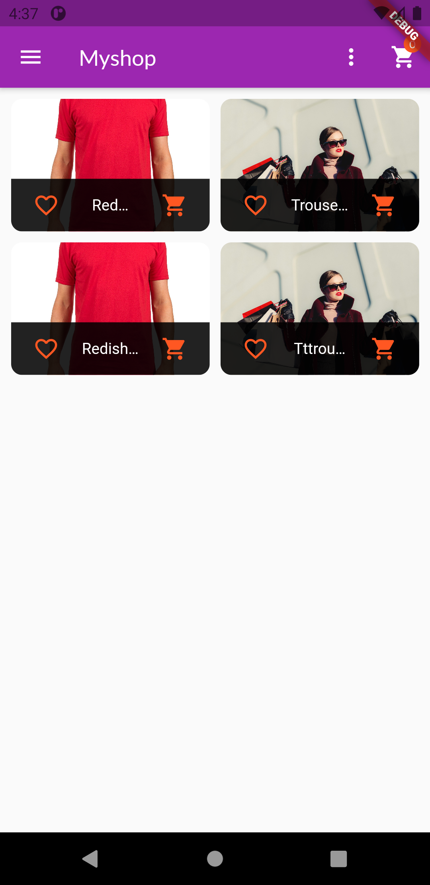
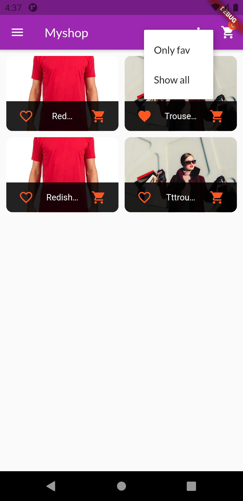
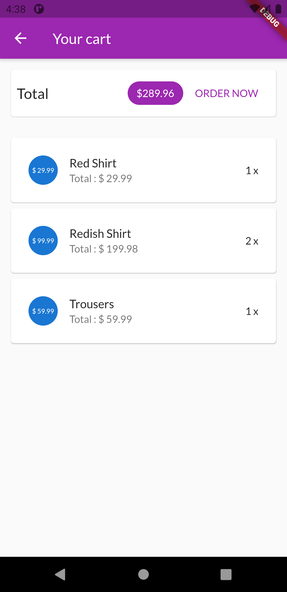
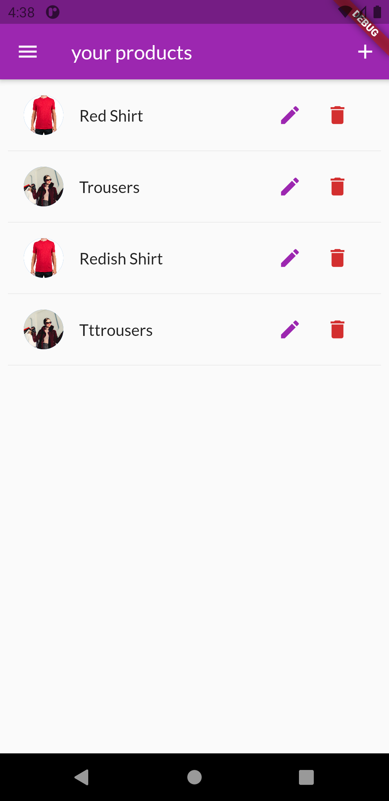
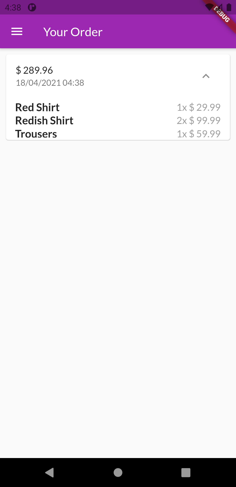
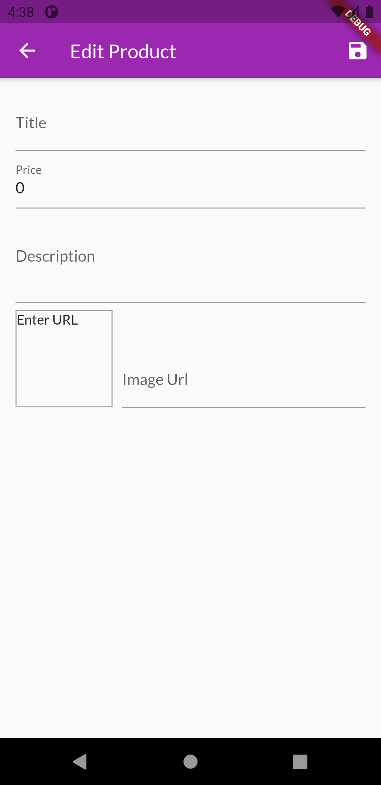
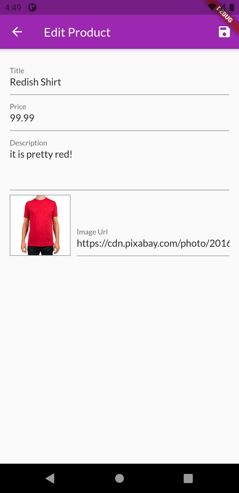

# myshop

A new Flutter project.

## Features

- Firebase Realtime Database
- Firebase Authentication
- State Management (Provider)
- Create, Read, Update, Delete, Product
- Bookmark/Favorite Product
- Search Product
- Read Orders
- Login/Logout
- Session

## Getting Started

This project is a starting point for a Flutter application.

An e-commerce app which allows users to buy and sell items :moneybag: .


Uses Firebase Realtime Database .

### Installation and Setup

* Fork the repo and clone it.
```
https://github.com/vikiwarrior/MyShop.git
```
* In the same directory run the following commands(considering you have flutter installed and an android device connected)
```
flutter packages get
flutter run
```

### Preview

|  |  |  |
|:--------------------------|:--------------------------|:--------------------------|
|  |  |  |
|  |

<p align='center'>Made With ❤️ By <a href="https://github.com/AqeelAaqi/myshop">Aqeel</a></p>

A few resources to get you started if this is your first Flutter project:

- [Lab: Write your first Flutter app](https://flutter.dev/docs/get-started/codelab)
- [Cookbook: Useful Flutter samples](https://flutter.dev/docs/cookbook)

For help getting started with Flutter, view our
[online documentation](https://flutter.dev/docs), which offers tutorials,
samples, guidance on mobile development, and a full API reference.
